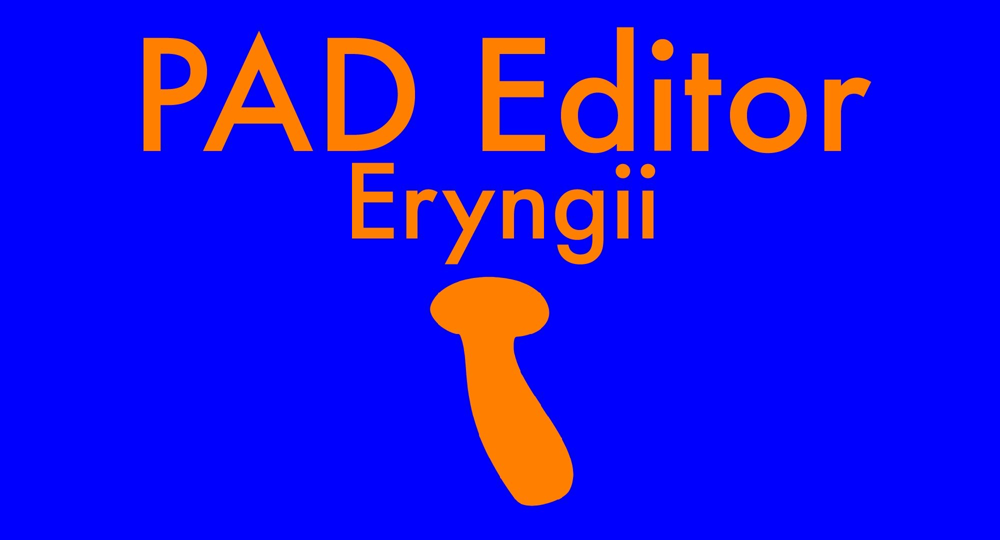

# PAD Editor *Eryngii*

Copyright © 2019–2020 KusaReMKN

*PAD Editor (MKNPAD) since 19-11-15, MKNPAD Eryngii since 20-03-05*

## これはなに

**PAD Editor** は KusaReMKN による PAD 開発・実行環境です。
北陸職業能力開発大学校 情報技術科 PAD Simulator Project による
[PAD Simulator](https://www.vector.co.jp/soft/win95/prog/se235608.html)
のユーザインタフェース改善、機能向上、及びマルチプラットフォーム対応を目標に開発されています。

MKNPAD Eryngii では、JavaScript 各ブロックを記述することで PAD Editor 内の実行環境で実行することができます。
また、C 系言語に向けた PAD → ソースコード(断片) のコンパイルもできます。

最新の PAD Editor は [kusaremkn.web.fc2.com](https://kusaremkn.web.fc2.com/) から利用できます。

## ブラウザ

JavaScript (ES2017) を利用します。
JavaScript を利用できない場合は動作しません。

HTML5 と CSS3 を利用しています。
対応していない場合は要素が正しく表示されず、正しく動作しない恐れがあります。

推奨ブラウザは、より推奨する順に (カッコ内は動作を確認したバージョンです)

- Mozilla Firefox (74.0 (64 bit))
- Google Chrome (80.0.3987.194 (64 bit)), Chromium
- Opera (67.0.3575.115 (64 bit))
- Microsoft Edge (80.0.361.69 (64 bit))

## ライセンス

現在検討中。
とりあえず
All rights reserved.
